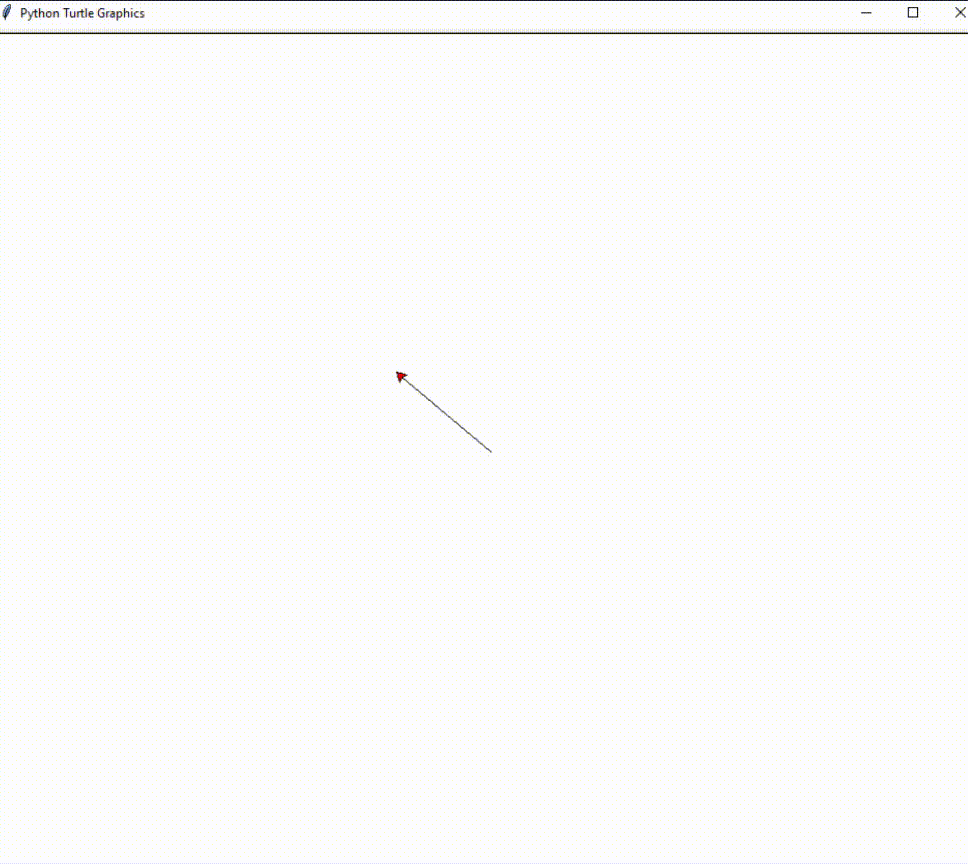

# Kalp Çizimi - Python
Python'da Turtle modülü kullanılarak Kalp Çizme kodları dosyada mevcuttur, kodun çıktısı aşağıdaki gibidir.

**İLETİŞİM**
> Benimle iletişim kurmak için linke tıklayabilirsiniz! 
> https://akifdora.github.io
